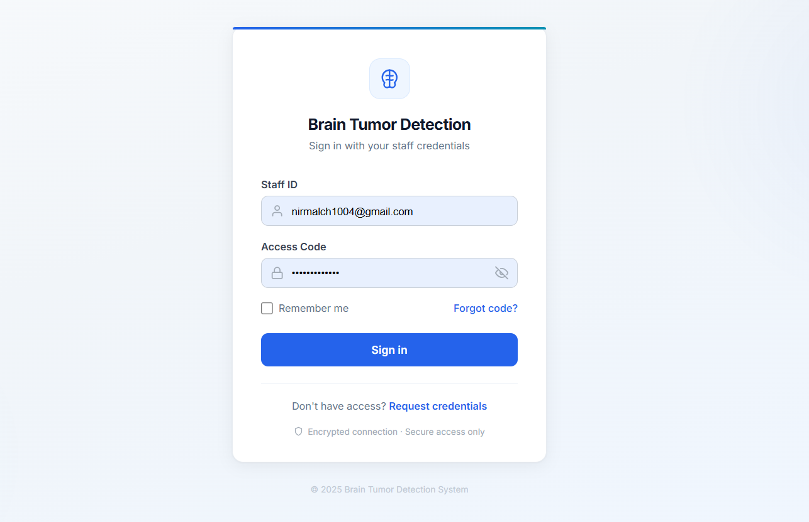
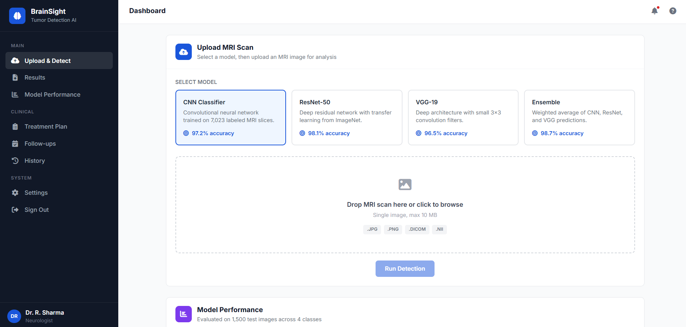

# Brain Tumor Detection Web App

This repository contains a Flask-based web application for brain tumor classification using deep learning.


## Project Overview

The app allows authenticated users to upload MRI images and classify them into one of four categories:
- Glioma
- Meningioma
- No Tumor
- Pituitary

It uses Flask for the web interface, MongoDB for user and prediction storage, and a TensorFlow model for image classification.

### Screenshots





## Included Model

Only the following model file is tracked in this repository:
- `model/model.h5`

All other model files in `model/` are excluded from Git using `.gitignore`.

## Repository Structure

- `app.py` — Flask application and prediction logic
- `requirements.txt` — required Python packages
- `Dockerfile` — container build instructions
- `accuracy.py` — model evaluation helper script
- `templates/` — HTML templates for app pages
- `static/` — frontend assets and CSS
- `model/model.h5` — included model file tracked by Git LFS

## Setup Instructions

1. Clone the repository:
   ```bash
   git clone https://github.com/nirmalchatur/Brain_Tumor_DeepLearning.git
   cd Brain_Tumor_DeepLearning
   ```

2. Create and activate a Python virtual environment:
   ```bash
   python -m venv .venv
   .\.venv\Scripts\activate
   ```

3. Install dependencies:
   ```bash
   pip install -r requirements.txt
   ```

4. Create required folders:
   ```bash
   mkdir static\uploads
   mkdir static\outputs
   ```

5. Run the Flask app:
   ```bash
   python app.py
   ```

6. Open the app:
   ```bash
   http://127.0.0.1:5000
   ```

## Important Notes

- The app currently uses hard-coded secrets and email settings in `app.py`; these should be moved to environment variables for production.
- `model/model.h5` is tracked with Git LFS due to its size.
- Temporary uploaded images and output images are ignored in Git.
